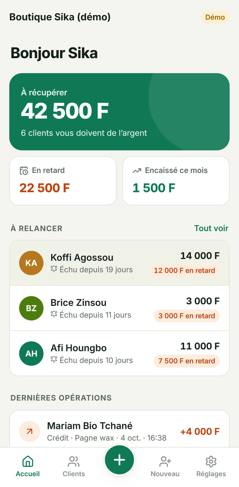
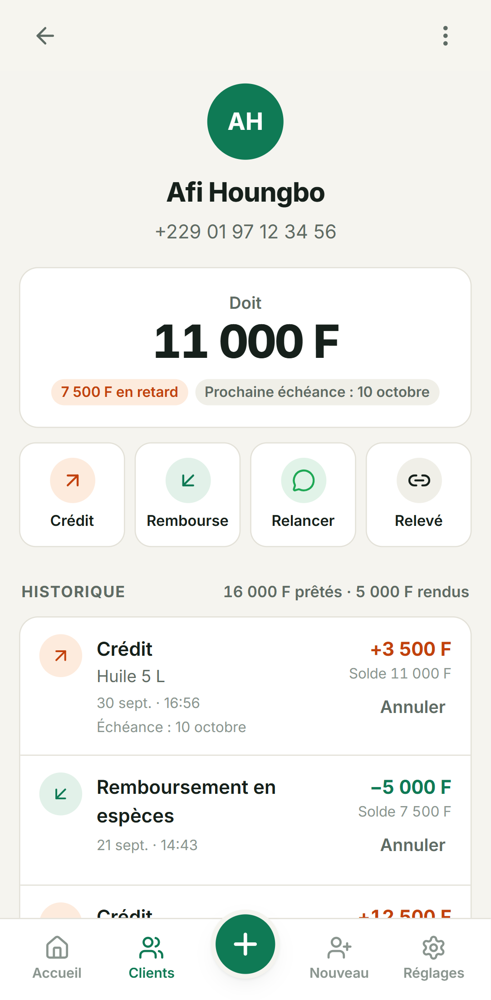
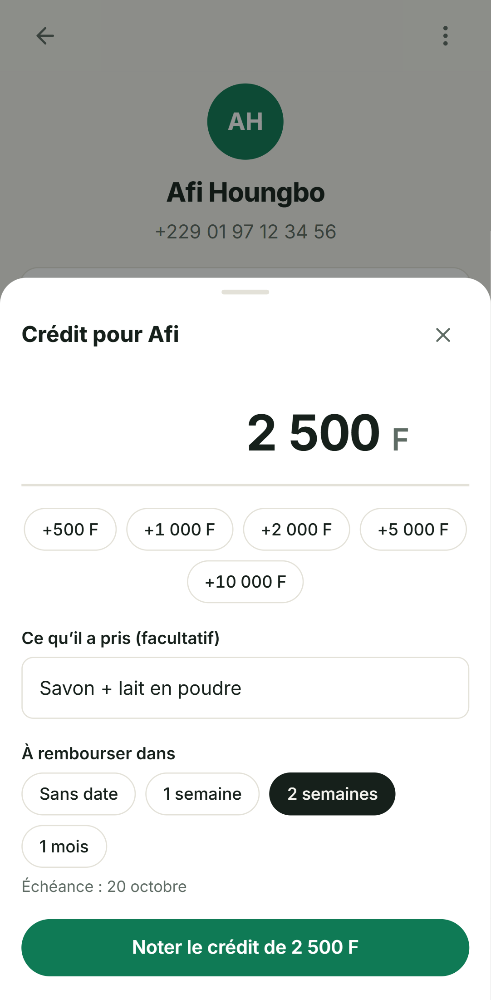
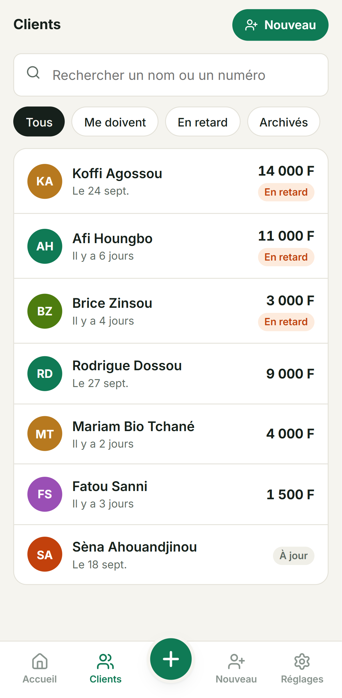
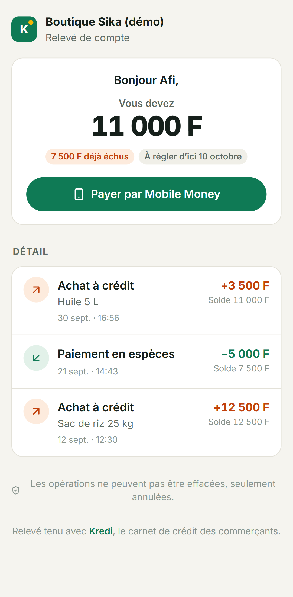
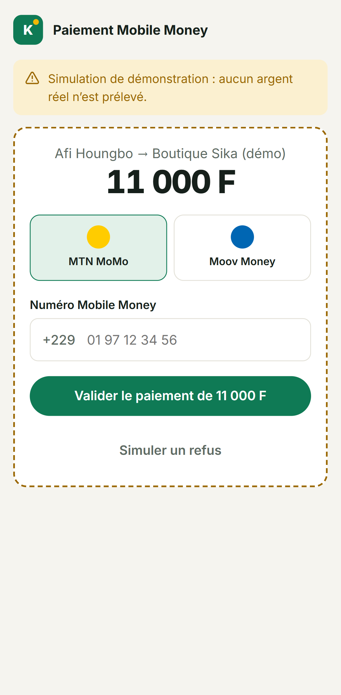

# Kredi · le carnet de crédit des commerçants

[](https://github.com/kabirADEMON/kredi/actions/workflows/ci.yml)


Au Bénin, comme dans toute l'Afrique de l'Ouest, les boutiques de quartier vendent à crédit et notent tout dans un cahier. Le cahier se perd, se mouille, et surtout **les clients contestent les montants** : une partie de l'argent n'est jamais récupérée.

**Kredi remplace ce cahier par une application web installable sur le téléphone** : la commerçante note un crédit en quelques secondes, le client reçoit sur WhatsApp un lien vers son relevé (qu'il ne peut pas modifier), et il rembourse en **Mobile Money** via FedaPay. Le remboursement s'inscrit tout seul dans le carnet.

<p align="center">
  
  
  
</p>
<p align="center">
  
  
  
</p>

## Ce que fait l'application

**Pour la commerçante**

- Inscription avec un numéro béninois et un code PIN à 4 chiffres : pas d'email, pas de mot de passe compliqué.
- Noter un **crédit** (montant, ce que le client a pris, échéance) ou un **remboursement** (espèces ou Mobile Money). Le bouton « + » est accessible depuis tous les écrans.
- **Tableau de bord** : total à récupérer, montant en retard, encaissé ce mois-ci, clients à relancer en priorité.
- **Relance WhatsApp** en un clic : message poli déjà rédigé, avec le solde, la part en retard et le lien du relevé.
- **Annulation** d'une erreur de saisie : l'opération reste visible, barrée. Rien n'est jamais effacé.
- Recherche, filtres (me doivent, en retard, archivés), archivage des clients soldés, export CSV pour Excel.
- Choix d'un client dans le répertoire du téléphone (Contact Picker API sur Android).
- Application installable (PWA), en français, montants en francs CFA.

**Pour le client, sans compte**

- Un relevé en lecture seule, ouvert depuis WhatsApp : solde, retard, détail de chaque achat et paiement.
- Paiement **MTN MoMo ou Moov Money** via FedaPay, total ou partiel.

**Démo** : le bouton « Essayer avec une boutique d'exemple » crée une boutique remplie de données réalistes, **propre à chaque visiteur** et effacée au bout de 24 h.

## Les choix techniques

| Sujet                | Choix                                                                                                                                                                                                | Pourquoi                                                                                                                      |
| -------------------- | ---------------------------------------------------------------------------------------------------------------------------------------------------------------------------------------------------- | ----------------------------------------------------------------------------------------------------------------------------- |
| Carnet infalsifiable | Les opérations ne sont **jamais modifiées ni supprimées**. Une erreur s'annule par une opération `reversal` qui pointe vers elle (contraintes `CHECK` et `UNIQUE` en base).                          | C'est ce qui rend le relevé crédible aux yeux du client, et donc ce qui met fin aux disputes.                                 |
| Solde                | **Jamais stocké** : il est recalculé à partir des opérations (`src/domain/ledger.ts`, fonctions pures testées).                                                                                      | Impossible de se désynchroniser.                                                                                              |
| Retards              | Les remboursements sont imputés aux crédits **les plus anciens d'abord (FIFO)**, puis on compare chaque reste dû à son échéance.                                                                     | C'est la règle qu'applique naturellement une commerçante.                                                                     |
| Concurrence          | Chaque saisie verrouille la ligne du client (`SELECT … FOR UPDATE`) dans une transaction.                                                                                                            | Deux remboursements simultanés (double clic, deux vendeurs) ne peuvent pas dépasser le solde : c'est testé.                   |
| Paiement             | Webhook FedaPay **signé** (HMAC-SHA256, horodatage limité à 5 min contre le rejeu), traitement **idempotent**, et interrogation de FedaPay au retour du client si le webhook tarde.                  | Un même paiement n'est jamais enregistré deux fois, et n'est jamais perdu.                                                    |
| Code PIN             | Haché avec **scrypt**, compte verrouillé 15 min après 5 échecs, limitation de débit par IP, message identique que le numéro existe ou non.                                                           | Un PIN à 4 chiffres a peu d'entropie : il faut ces trois protections ensemble.                                                |
| Sessions             | JWT dans un cookie `HttpOnly` `SameSite=Lax`. Changer de PIN incrémente une version de session et **déconnecte les autres appareils**. L'API n'accepte que du JSON (protection CSRF supplémentaire). |                                                                                                                               |
| Lien du relevé       | Jeton aléatoire de 128 bits, **révocable** en un clic.                                                                                                                                               | Impossible à deviner, et un lien transféré par erreur peut être coupé.                                                        |
| Base de données      | **PostgreSQL** avec Drizzle ORM et migrations SQL versionnées. Sans `DATABASE_URL`, l'API utilise **PGlite** (Postgres compilé en WebAssembly).                                                      | Le projet se lance avec `npm install && npm run dev`, sans rien installer, et les tests tournent sur le vrai moteur Postgres. |
| Numéros béninois     | Normalisation vers le format à 10 chiffres en vigueur depuis le 30 novembre 2024 (`01` + ancien numéro), `+229` accepté.                                                                             |                                                                                                                               |
| Export CSV           | BOM UTF-8, séparateur `;`, neutralisation des formules (`=`, `+`, `-`, `@`).                                                                                                                         | S'ouvre correctement dans Excel en français, sans injection de formule.                                                       |

## Architecture

```
apps/
  api/                Express 5 · TypeScript · Drizzle · Zod
    src/domain/       règles métier pures (solde, retards, annulations, numéros)
    src/services/     carnet, paiements, données d'exemple
    src/payments/     FedaPay et prestataire simulé, derrière la même interface
    src/routes/       auth, carnet, relevé public, webhook
    drizzle/          migrations SQL
    test/             65 tests (Vitest + Supertest sur PGlite)
  web/                React 19 · TypeScript · React Router · TanStack Query · PWA
    e2e/              tests de bout en bout (Playwright)
```

En production, l'API sert aussi l'interface compilée : une seule application, un seul domaine, des cookies simples.

## Lancer le projet

Prérequis : Node.js 20 ou plus.

```bash
npm install
cp .env.example apps/api/.env   # facultatif : tout a une valeur par défaut
npm run dev                     # API sur :3000, interface sur http://localhost:5173
```

Sans configuration, la base est un fichier PGlite local et le paiement est simulé. Pour un compte d'exemple : `npm run seed` (numéro `01 00 00 00 01`, code `2580`).

## Tests

```bash
npm test            # 65 tests de l'API : règles métier, sécurité, concurrence, webhook FedaPay
npm run test:e2e    # 10 parcours dans un vrai navigateur (après npm run build)
```

Les tests de bout en bout jouent le parcours complet : inscription, ajout d'un client, crédit, remboursement refusé s'il dépasse le solde, annulation, lien WhatsApp, relevé ouvert par le client, paiement Mobile Money, mise à jour du carnet, changement de PIN, verrouillage, démo. La CI GitHub Actions lance le formatage, les types, les tests de l'API, la compilation et les tests de bout en bout à chaque push.

## Déploiement

- **Render** : `render.yaml` décrit le service web (Docker) et la base PostgreSQL.
- **N'importe quel hébergeur Docker** : `docker build -t kredi .` puis `docker run -p 3000:3000 -e DATABASE_URL=… -e JWT_SECRET=… -e APP_URL=… kredi`.

Pour encaisser réellement, renseignez `FEDAPAY_SECRET_KEY` et `FEDAPAY_WEBHOOK_SECRET`, puis déclarez le webhook `https://<votre-domaine>/api/webhooks/fedapay` dans le tableau de bord FedaPay. En production, le paiement simulé n'est autorisé qu'en mode démo.

| Variable                                                      | Rôle                                                                        |
| ------------------------------------------------------------- | --------------------------------------------------------------------------- |
| `DATABASE_URL`                                                | PostgreSQL. Absente : PGlite dans `apps/api/.data`.                         |
| `JWT_SECRET`                                                  | Obligatoire en production (32 caractères minimum).                          |
| `APP_URL`                                                     | URL publique, utilisée dans les liens WhatsApp et le retour de paiement.    |
| `FEDAPAY_SECRET_KEY`, `FEDAPAY_WEBHOOK_SECRET`, `FEDAPAY_ENV` | Paiement réel (`sandbox` ou `live`).                                        |
| `DEMO_MODE`                                                   | Active le bouton de démo.                                                   |
| `TRUST_PROXY`                                                 | À activer derrière un proxy (Render, Railway…) pour la limitation de débit. |

## Et ensuite

- Rappels automatiques par SMS ou WhatsApp Business à l'échéance.
- Plusieurs vendeurs par boutique, avec des rôles.
- Saisie hors ligne avec synchronisation au retour du réseau.

## Licence

MIT, © 2026 Kabir ADEMON.
